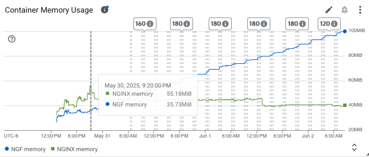
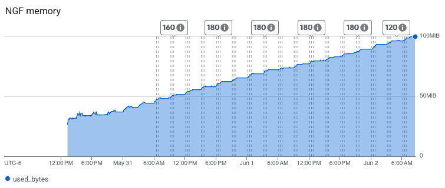
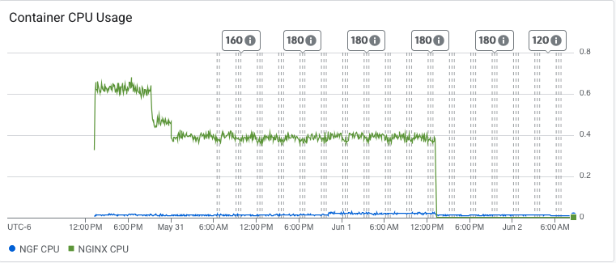

# Results

## Summary

These results are incomplete and may be inaccurate. The test was stopped manually about 1 day early, and results such as logs and traffic summary were not collected properly by the teardown scripts/functions.

There are fewer dashboards to collect now after the change in architecture, as we don't have the same metrics as we did before, mainly relating to reloads.

One thing of note is the significant increase in memory usage for the NGF control plane container. For our NGINX Plus run, the opposite occurred, where the NGINX container had high memory.

## Test environment

NGINX Plus: false

NGINX Gateway Fabric:

- Commit: cc3c907ff668d886cac719df2d77b685370ad5f8
- Date: 2025-05-30T18:25:58Z
- Dirty: false

GKE Cluster:

- Node count: 3
- k8s version: v1.32.4-gke.1106006
- vCPUs per node: 2
- RAM per node: 4015484Ki
- Max pods per node: 110
- Zone: us-west2-a
- Instance Type: e2-medium

## Key Metrics

### Containers memory

### NGF Container Memory

### Containers CPU

