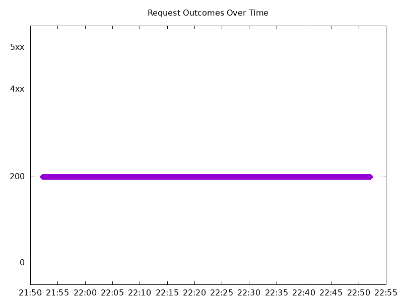

# Results

## Test environment

NGINX Plus: false

NGINX Gateway Fabric:

- Commit: 9155a2b6a8d3179165797ef3e789e97283f7a695
- Date: 2025-03-15T07:17:11Z
- Dirty: false

GKE Cluster:

- Node count: 12
- k8s version: v1.31.6-gke.1020000
- vCPUs per node: 16
- RAM per node: 65851340Ki
- Max pods per node: 110
- Zone: us-west1-b
- Instance Type: n2d-standard-16

## Test: Send http /coffee traffic

```text
Requests      [total, rate, throughput]         6000, 100.02, 100.01
Duration      [total, attack, wait]             59.992s, 59.991s, 864.529µs
Latencies     [min, mean, 50, 90, 95, 99, max]  470.608µs, 866.796µs, 864.021µs, 991.562µs, 1.037ms, 1.156ms, 10.317ms
Bytes In      [total, mean]                     967993, 161.33
Bytes Out     [total, mean]                     0, 0.00
Success       [ratio]                           100.00%
Status Codes  [code:count]                      200:6000  
Error Set:
```



## Test: Send https /tea traffic

```text
Requests      [total, rate, throughput]         6000, 100.02, 100.01
Duration      [total, attack, wait]             59.992s, 59.991s, 850.998µs
Latencies     [min, mean, 50, 90, 95, 99, max]  455.17µs, 901.793µs, 886.37µs, 1.017ms, 1.06ms, 1.177ms, 10.281ms
Bytes In      [total, mean]                     931993, 155.33
Bytes Out     [total, mean]                     0, 0.00
Success       [ratio]                           100.00%
Status Codes  [code:count]                      200:6000  
Error Set:
```


