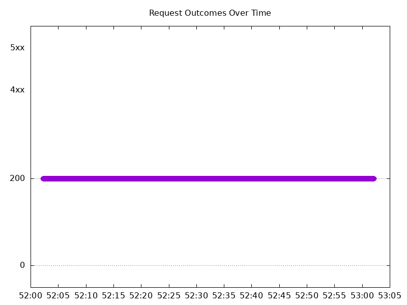

# Results

## Test environment

NGINX Plus: true

NGINX Gateway Fabric:

- Commit: 9155a2b6a8d3179165797ef3e789e97283f7a695
- Date: 2025-03-15T07:17:11Z
- Dirty: false

GKE Cluster:

- Node count: 12
- k8s version: v1.31.6-gke.1020000
- vCPUs per node: 16
- RAM per node: 65851340Ki
- Max pods per node: 110
- Zone: us-west1-b
- Instance Type: n2d-standard-16

## Test: Send http /coffee traffic

```text
Requests      [total, rate, throughput]         6000, 100.02, 100.02
Duration      [total, attack, wait]             59.99s, 59.989s, 855.743µs
Latencies     [min, mean, 50, 90, 95, 99, max]  635.422µs, 851.551µs, 832.349µs, 964.217µs, 1.017ms, 1.176ms, 9.726ms
Bytes In      [total, mean]                     972000, 162.00
Bytes Out     [total, mean]                     0, 0.00
Success       [ratio]                           100.00%
Status Codes  [code:count]                      200:6000  
Error Set:
```


## Test: Send https /tea traffic

```text
Requests      [total, rate, throughput]         6000, 100.02, 100.02
Duration      [total, attack, wait]             59.991s, 59.99s, 673.229µs
Latencies     [min, mean, 50, 90, 95, 99, max]  439.111µs, 903.895µs, 887.003µs, 1.057ms, 1.116ms, 1.284ms, 9.699ms
Bytes In      [total, mean]                     936000, 156.00
Bytes Out     [total, mean]                     0, 0.00
Success       [ratio]                           100.00%
Status Codes  [code:count]                      200:6000  
Error Set:
```


