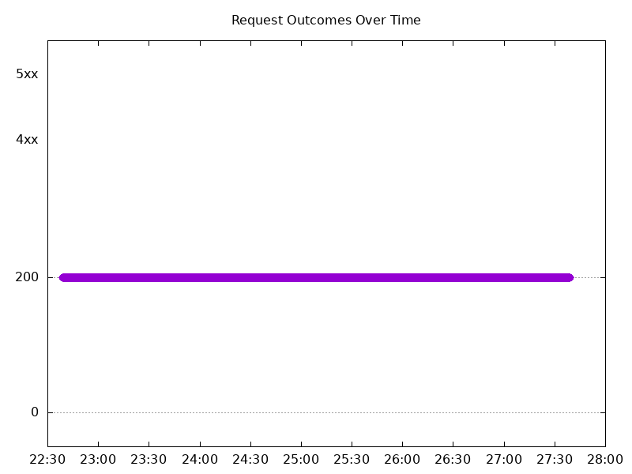
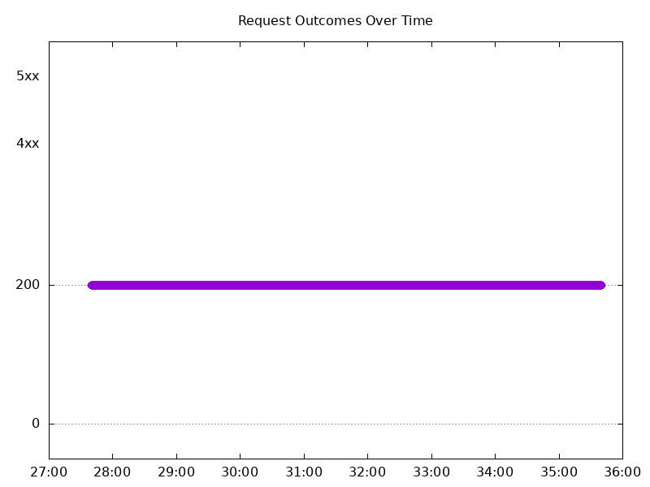
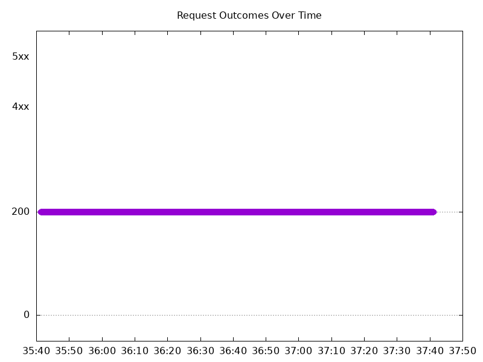
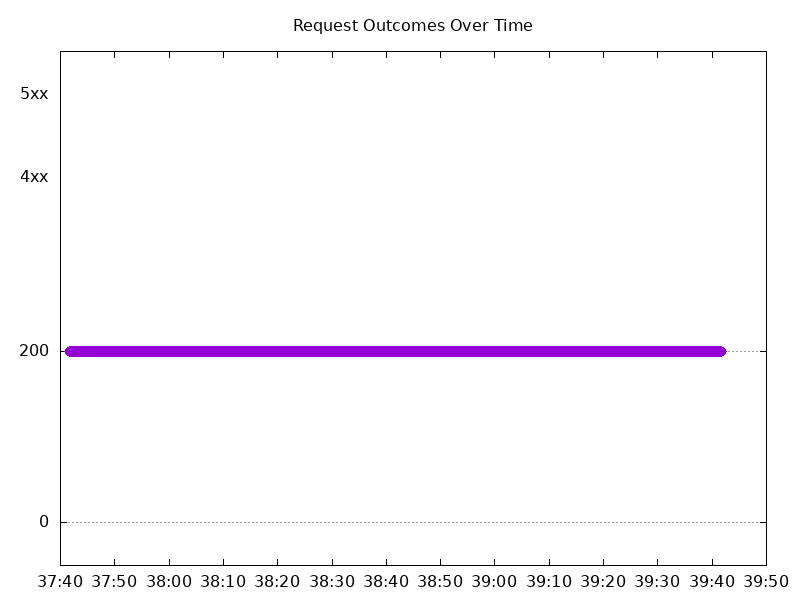
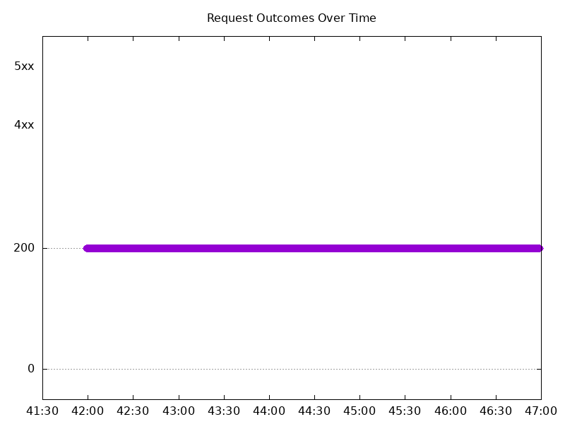
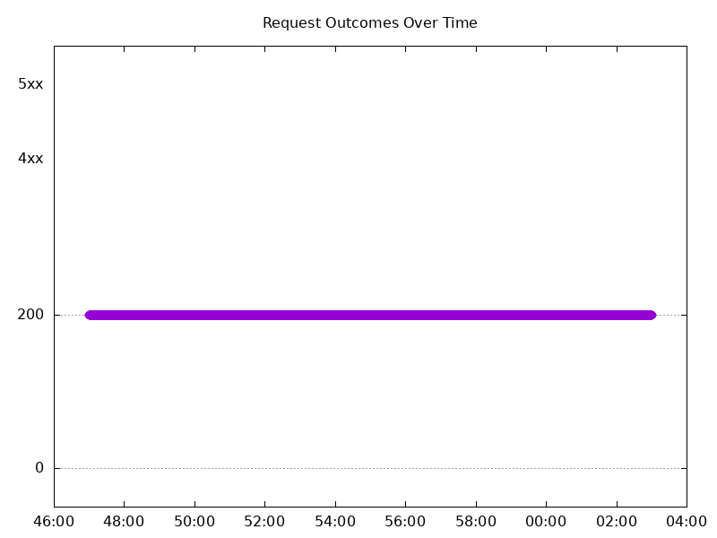
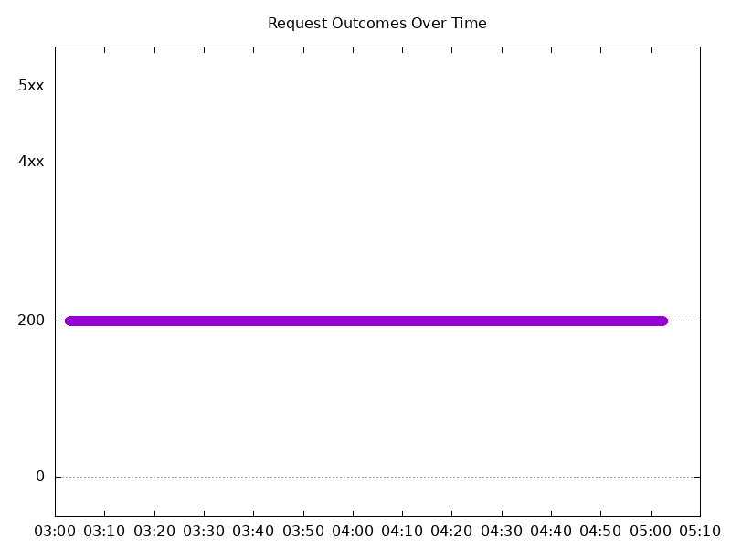
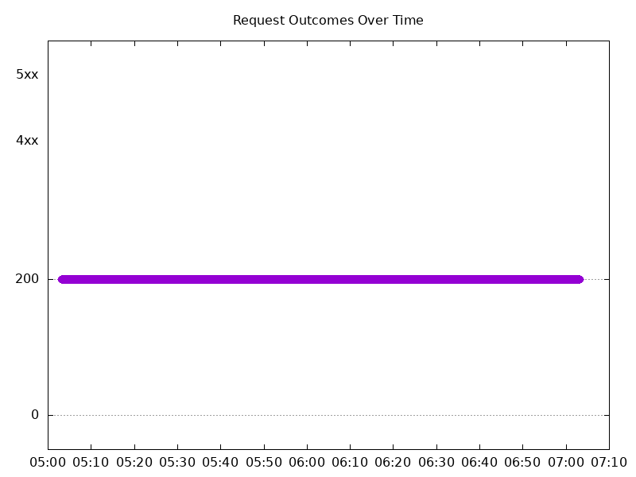

# Results

## Test environment

NGINX Plus: false

NGINX Gateway Fabric:

- Commit: f06b10da4a1754e253a58a31d2eff1bd404e33cd
- Date: 2025-06-02T15:20:05Z
- Dirty: false

GKE Cluster:

- Node count: 12
- k8s version: v1.32.4-gke.1106006
- vCPUs per node: 16
- RAM per node: 65851340Ki
- Max pods per node: 110
- Zone: us-west1-b
- Instance Type: n2d-standard-16

## Summary:

- Increased latency in requests.

## One NGINX Pod runs per node Test Results

### Scale Up Gradually

#### Test: Send https /tea traffic

```text
Requests      [total, rate, throughput]         30000, 100.00, 100.00
Duration      [total, attack, wait]             5m0s, 5m0s, 1.141ms
Latencies     [min, mean, 50, 90, 95, 99, max]  694.688µs, 1.335ms, 1.2ms, 1.383ms, 1.489ms, 1.788ms, 213.102ms
Bytes In      [total, mean]                     4652952, 155.10
Bytes Out     [total, mean]                     0, 0.00
Success       [ratio]                           100.00%
Status Codes  [code:count]                      200:30000  
Error Set:
```


#### Test: Send http /coffee traffic

```text
Requests      [total, rate, throughput]         30000, 100.00, 100.00
Duration      [total, attack, wait]             5m0s, 5m0s, 1.107ms
Latencies     [min, mean, 50, 90, 95, 99, max]  681.597µs, 1.24ms, 1.176ms, 1.341ms, 1.428ms, 1.746ms, 152.544ms
Bytes In      [total, mean]                     4832961, 161.10
Bytes Out     [total, mean]                     0, 0.00
Success       [ratio]                           100.00%
Status Codes  [code:count]                      200:30000  
Error Set:
```



### Scale Down Gradually

#### Test: Send http /coffee traffic

```text
Requests      [total, rate, throughput]         48000, 100.00, 100.00
Duration      [total, attack, wait]             8m0s, 8m0s, 1.482ms
Latencies     [min, mean, 50, 90, 95, 99, max]  646.651µs, 1.223ms, 1.204ms, 1.425ms, 1.533ms, 1.799ms, 15.965ms
Bytes In      [total, mean]                     7732691, 161.10
Bytes Out     [total, mean]                     0, 0.00
Success       [ratio]                           100.00%
Status Codes  [code:count]                      200:48000  
Error Set:
```



#### Test: Send https /tea traffic

```text
Requests      [total, rate, throughput]         48000, 100.00, 100.00
Duration      [total, attack, wait]             8m0s, 8m0s, 1.502ms
Latencies     [min, mean, 50, 90, 95, 99, max]  692.557µs, 1.277ms, 1.226ms, 1.484ms, 1.597ms, 1.876ms, 214.566ms
Bytes In      [total, mean]                     7444787, 155.10
Bytes Out     [total, mean]                     0, 0.00
Success       [ratio]                           100.00%
Status Codes  [code:count]                      200:48000  
Error Set:
```


### Scale Up Abruptly

#### Test: Send https /tea traffic

```text
Requests      [total, rate, throughput]         12000, 100.01, 100.01
Duration      [total, attack, wait]             2m0s, 2m0s, 1.147ms
Latencies     [min, mean, 50, 90, 95, 99, max]  701.455µs, 1.259ms, 1.211ms, 1.543ms, 1.649ms, 1.905ms, 6.534ms
Bytes In      [total, mean]                     1861234, 155.10
Bytes Out     [total, mean]                     0, 0.00
Success       [ratio]                           100.00%
Status Codes  [code:count]                      200:12000  
Error Set:
```



#### Test: Send http /coffee traffic

```text
Requests      [total, rate, throughput]         12000, 100.01, 100.01
Duration      [total, attack, wait]             2m0s, 2m0s, 1.133ms
Latencies     [min, mean, 50, 90, 95, 99, max]  678.456µs, 1.238ms, 1.207ms, 1.493ms, 1.601ms, 1.835ms, 7.908ms
Bytes In      [total, mean]                     1933243, 161.10
Bytes Out     [total, mean]                     0, 0.00
Success       [ratio]                           100.00%
Status Codes  [code:count]                      200:12000  
Error Set:
```


### Scale Down Abruptly

#### Test: Send https /tea traffic

```text
Requests      [total, rate, throughput]         12000, 100.01, 100.01
Duration      [total, attack, wait]             2m0s, 2m0s, 1.252ms
Latencies     [min, mean, 50, 90, 95, 99, max]  679.727µs, 1.367ms, 1.333ms, 1.595ms, 1.689ms, 1.942ms, 205.763ms
Bytes In      [total, mean]                     1861231, 155.10
Bytes Out     [total, mean]                     0, 0.00
Success       [ratio]                           100.00%
Status Codes  [code:count]                      200:12000  
Error Set:
```



#### Test: Send http /coffee traffic

```text
Requests      [total, rate, throughput]         12000, 100.01, 100.01
Duration      [total, attack, wait]             2m0s, 2m0s, 1.173ms
Latencies     [min, mean, 50, 90, 95, 99, max]  747.649µs, 1.335ms, 1.318ms, 1.548ms, 1.631ms, 1.882ms, 20.583ms
Bytes In      [total, mean]                     1933152, 161.10
Bytes Out     [total, mean]                     0, 0.00
Success       [ratio]                           100.00%
Status Codes  [code:count]                      200:12000  
Error Set:
```


## Multiple NGINX Pods run per node Test Results

### Scale Up Gradually

#### Test: Send http /coffee traffic

```text
Requests      [total, rate, throughput]         30000, 100.00, 100.00
Duration      [total, attack, wait]             5m0s, 5m0s, 822.54µs
Latencies     [min, mean, 50, 90, 95, 99, max]  632.932µs, 1.174ms, 1.161ms, 1.323ms, 1.394ms, 1.75ms, 219.038ms
Bytes In      [total, mean]                     4832958, 161.10
Bytes Out     [total, mean]                     0, 0.00
Success       [ratio]                           100.00%
Status Codes  [code:count]                      200:30000  
Error Set:
```



#### Test: Send https /tea traffic

```text
Requests      [total, rate, throughput]         30000, 100.00, 100.00
Duration      [total, attack, wait]             5m0s, 5m0s, 932.669µs
Latencies     [min, mean, 50, 90, 95, 99, max]  695.876µs, 1.213ms, 1.177ms, 1.331ms, 1.397ms, 1.778ms, 215.163ms
Bytes In      [total, mean]                     4653003, 155.10
Bytes Out     [total, mean]                     0, 0.00
Success       [ratio]                           100.00%
Status Codes  [code:count]                      200:30000  
Error Set:
```


### Scale Down Gradually

#### Test: Send https /tea traffic

```text
Requests      [total, rate, throughput]         96000, 100.00, 100.00
Duration      [total, attack, wait]             16m0s, 16m0s, 1.153ms
Latencies     [min, mean, 50, 90, 95, 99, max]  653.358µs, 1.208ms, 1.191ms, 1.357ms, 1.437ms, 1.725ms, 208.482ms
Bytes In      [total, mean]                     14889785, 155.10
Bytes Out     [total, mean]                     0, 0.00
Success       [ratio]                           100.00%
Status Codes  [code:count]                      200:96000  
Error Set:
```


#### Test: Send http /coffee traffic

```text
Requests      [total, rate, throughput]         96000, 100.00, 100.00
Duration      [total, attack, wait]             16m0s, 16m0s, 1.064ms
Latencies     [min, mean, 50, 90, 95, 99, max]  644.11µs, 1.193ms, 1.183ms, 1.359ms, 1.436ms, 1.716ms, 208.817ms
Bytes In      [total, mean]                     15465607, 161.10
Bytes Out     [total, mean]                     0, 0.00
Success       [ratio]                           100.00%
Status Codes  [code:count]                      200:96000  
Error Set:
```



### Scale Up Abruptly

#### Test: Send https /tea traffic

```text
Requests      [total, rate, throughput]         12000, 100.01, 100.01
Duration      [total, attack, wait]             2m0s, 2m0s, 1.245ms
Latencies     [min, mean, 50, 90, 95, 99, max]  687.053µs, 1.223ms, 1.201ms, 1.436ms, 1.546ms, 1.778ms, 5.903ms
Bytes In      [total, mean]                     1861203, 155.10
Bytes Out     [total, mean]                     0, 0.00
Success       [ratio]                           100.00%
Status Codes  [code:count]                      200:12000  
Error Set:
```



#### Test: Send http /coffee traffic

```text
Requests      [total, rate, throughput]         12000, 100.01, 100.01
Duration      [total, attack, wait]             2m0s, 2m0s, 1.27ms
Latencies     [min, mean, 50, 90, 95, 99, max]  684.231µs, 1.18ms, 1.169ms, 1.354ms, 1.439ms, 1.726ms, 7.767ms
Bytes In      [total, mean]                     1933221, 161.10
Bytes Out     [total, mean]                     0, 0.00
Success       [ratio]                           100.00%
Status Codes  [code:count]                      200:12000  
Error Set:
```


### Scale Down Abruptly

#### Test: Send https /tea traffic

```text
Requests      [total, rate, throughput]         12000, 100.01, 100.01
Duration      [total, attack, wait]             2m0s, 2m0s, 1.361ms
Latencies     [min, mean, 50, 90, 95, 99, max]  657.739µs, 1.241ms, 1.221ms, 1.383ms, 1.451ms, 1.661ms, 209.787ms
Bytes In      [total, mean]                     1861235, 155.10
Bytes Out     [total, mean]                     0, 0.00
Success       [ratio]                           100.00%
Status Codes  [code:count]                      200:12000  
Error Set:
```


#### Test: Send http /coffee traffic

```text
Requests      [total, rate, throughput]         12000, 100.01, 100.01
Duration      [total, attack, wait]             2m0s, 2m0s, 1.356ms
Latencies     [min, mean, 50, 90, 95, 99, max]  684.483µs, 1.211ms, 1.21ms, 1.368ms, 1.431ms, 1.618ms, 12.796ms
Bytes In      [total, mean]                     1933178, 161.10
Bytes Out     [total, mean]                     0, 0.00
Success       [ratio]                           100.00%
Status Codes  [code:count]                      200:12000  
Error Set:
```


