# Results

## Test environment

NGINX Plus: true

NGINX Gateway Fabric:

- Commit: f06b10da4a1754e253a58a31d2eff1bd404e33cd
- Date: 2025-06-02T15:20:05Z
- Dirty: false

GKE Cluster:

- Node count: 12
- k8s version: v1.32.4-gke.1106006
- vCPUs per node: 16
- RAM per node: 65851340Ki
- Max pods per node: 110
- Zone: us-west1-b
- Instance Type: n2d-standard-16

## Summary:

- Increased latency in requests.
- Quite a few 502 errors, could be due to load balancer issues for this test run.

## One NGINX Pod runs per node Test Results

### Scale Up Gradually

#### Test: Send https /tea traffic

```text
Requests      [total, rate, throughput]         30000, 100.00, 100.00
Duration      [total, attack, wait]             5m0s, 5m0s, 1.239ms
Latencies     [min, mean, 50, 90, 95, 99, max]  605.991µs, 1.15ms, 1.13ms, 1.331ms, 1.417ms, 1.722ms, 13.752ms
Bytes In      [total, mean]                     4622957, 154.10
Bytes Out     [total, mean]                     0, 0.00
Success       [ratio]                           100.00%
Status Codes  [code:count]                      200:30000  
Error Set:
```

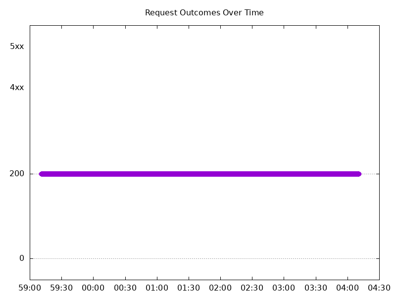

#### Test: Send http /coffee traffic

```text
Requests      [total, rate, throughput]         30000, 100.00, 100.00
Duration      [total, attack, wait]             5m0s, 5m0s, 1.117ms
Latencies     [min, mean, 50, 90, 95, 99, max]  604.088µs, 1.133ms, 1.113ms, 1.311ms, 1.385ms, 1.696ms, 206.07ms
Bytes In      [total, mean]                     4805954, 160.20
Bytes Out     [total, mean]                     0, 0.00
Success       [ratio]                           100.00%
Status Codes  [code:count]                      200:30000  
Error Set:
```


### Scale Down Gradually

#### Test: Send https /tea traffic

```text
Requests      [total, rate, throughput]         48000, 100.00, 100.00
Duration      [total, attack, wait]             8m0s, 8m0s, 1.358ms
Latencies     [min, mean, 50, 90, 95, 99, max]  616.744µs, 1.166ms, 1.153ms, 1.344ms, 1.416ms, 1.668ms, 16.868ms
Bytes In      [total, mean]                     7396614, 154.10
Bytes Out     [total, mean]                     0, 0.00
Success       [ratio]                           100.00%
Status Codes  [code:count]                      200:48000  
Error Set:
```


#### Test: Send http /coffee traffic

```text
Requests      [total, rate, throughput]         48000, 100.00, 100.00
Duration      [total, attack, wait]             8m0s, 8m0s, 1.306ms
Latencies     [min, mean, 50, 90, 95, 99, max]  584.562µs, 1.143ms, 1.127ms, 1.306ms, 1.368ms, 1.614ms, 215.829ms
Bytes In      [total, mean]                     7689634, 160.20
Bytes Out     [total, mean]                     0, 0.00
Success       [ratio]                           100.00%
Status Codes  [code:count]                      200:48000  
Error Set:
```


### Scale Up Abruptly

#### Test: Send http /coffee traffic

```text
Requests      [total, rate, throughput]         12000, 100.01, 66.67
Duration      [total, attack, wait]             2m0s, 2m0s, 510.001µs
Latencies     [min, mean, 50, 90, 95, 99, max]  401.714µs, 935.722µs, 1.033ms, 1.245ms, 1.304ms, 1.452ms, 7.179ms
Bytes In      [total, mean]                     1880825, 156.74
Bytes Out     [total, mean]                     0, 0.00
Success       [ratio]                           66.67%
Status Codes  [code:count]                      0:5  200:8000  502:3995  
Error Set:
Get "http://cafe.example.com/coffee": dial tcp 0.0.0.0:0->redacted:80: connect: connection refused
502 Bad Gateway
```

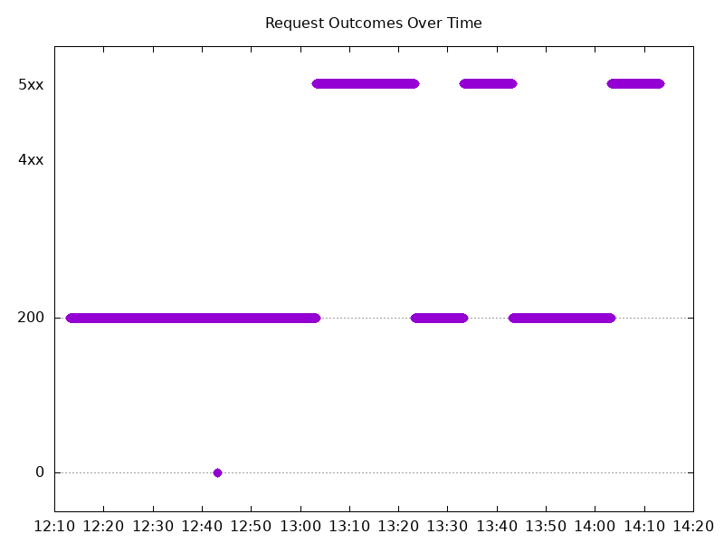

#### Test: Send https /tea traffic

```text
Requests      [total, rate, throughput]         12000, 100.01, 100.00
Duration      [total, attack, wait]             2m0s, 2m0s, 876.584µs
Latencies     [min, mean, 50, 90, 95, 99, max]  601.132µs, 1.175ms, 1.165ms, 1.358ms, 1.422ms, 1.638ms, 12.009ms
Bytes In      [total, mean]                     1849023, 154.09
Bytes Out     [total, mean]                     0, 0.00
Success       [ratio]                           99.99%
Status Codes  [code:count]                      0:1  200:11999  
Error Set:
Get "https://cafe.example.com/tea": dial tcp 0.0.0.0:0->redacted:443: connect: connection refused
```

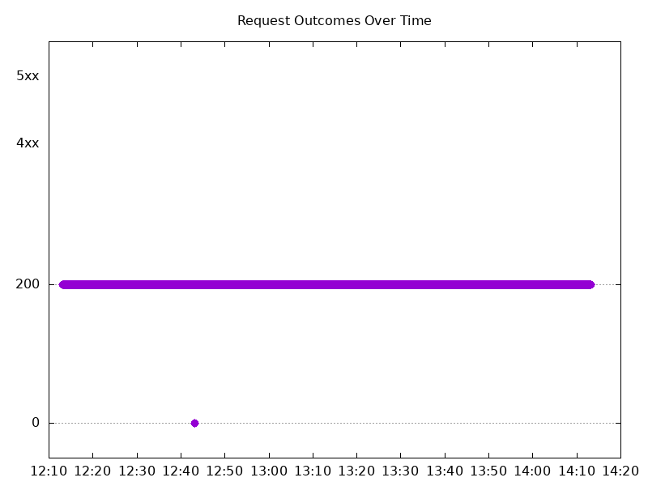

### Scale Down Abruptly

#### Test: Send http /coffee traffic

```text
Requests      [total, rate, throughput]         12000, 100.01, 75.01
Duration      [total, attack, wait]             2m0s, 2m0s, 1.354ms
Latencies     [min, mean, 50, 90, 95, 99, max]  362.267µs, 1.05ms, 1.141ms, 1.365ms, 1.435ms, 1.605ms, 17.379ms
Bytes In      [total, mean]                     1891781, 157.65
Bytes Out     [total, mean]                     0, 0.00
Success       [ratio]                           75.00%
Status Codes  [code:count]                      200:9000  502:3000  
Error Set:
502 Bad Gateway
```

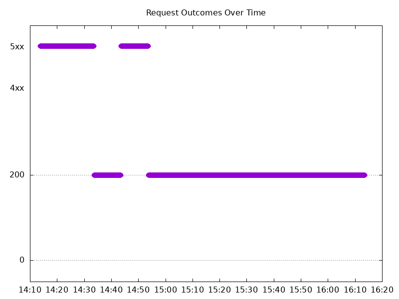

#### Test: Send https /tea traffic

```text
Requests      [total, rate, throughput]         12000, 100.01, 100.01
Duration      [total, attack, wait]             2m0s, 2m0s, 1.269ms
Latencies     [min, mean, 50, 90, 95, 99, max]  600.937µs, 1.218ms, 1.206ms, 1.405ms, 1.476ms, 1.685ms, 8.108ms
Bytes In      [total, mean]                     1849128, 154.09
Bytes Out     [total, mean]                     0, 0.00
Success       [ratio]                           100.00%
Status Codes  [code:count]                      200:12000  
Error Set:
```

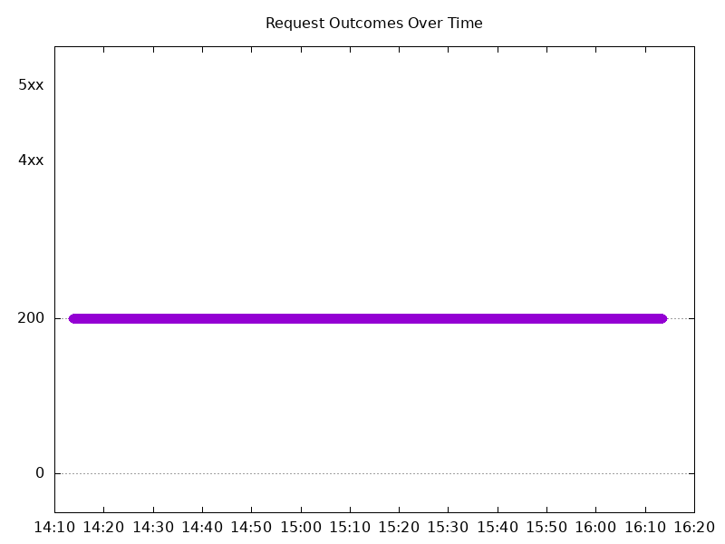

## Multiple NGINX Pods run per node Test Results

### Scale Up Gradually

#### Test: Send http /coffee traffic

```text
Requests      [total, rate, throughput]         30000, 100.00, 100.00
Duration      [total, attack, wait]             5m0s, 5m0s, 1.181ms
Latencies     [min, mean, 50, 90, 95, 99, max]  622.202µs, 1.144ms, 1.132ms, 1.304ms, 1.369ms, 1.648ms, 211.565ms
Bytes In      [total, mean]                     4805917, 160.20
Bytes Out     [total, mean]                     0, 0.00
Success       [ratio]                           100.00%
Status Codes  [code:count]                      200:30000  
Error Set:
```


#### Test: Send https /tea traffic

```text
Requests      [total, rate, throughput]         30000, 100.00, 100.00
Duration      [total, attack, wait]             5m0s, 5m0s, 1.117ms
Latencies     [min, mean, 50, 90, 95, 99, max]  644.069µs, 1.174ms, 1.163ms, 1.339ms, 1.409ms, 1.704ms, 16.884ms
Bytes In      [total, mean]                     4623044, 154.10
Bytes Out     [total, mean]                     0, 0.00
Success       [ratio]                           100.00%
Status Codes  [code:count]                      200:30000  
Error Set:
```

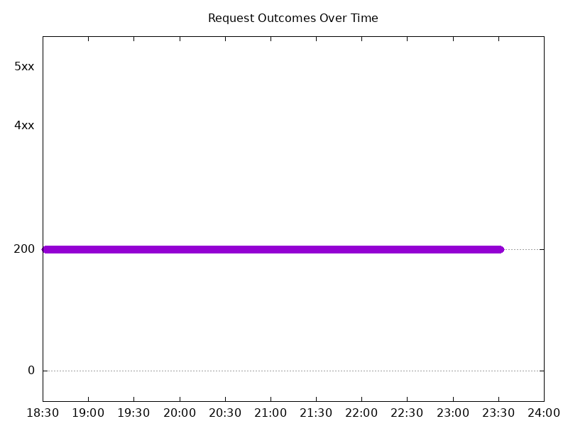

### Scale Down Gradually

#### Test: Send https /tea traffic

```text
Requests      [total, rate, throughput]         96000, 100.00, 100.00
Duration      [total, attack, wait]             16m0s, 16m0s, 982.209µs
Latencies     [min, mean, 50, 90, 95, 99, max]  599.14µs, 1.181ms, 1.156ms, 1.349ms, 1.427ms, 1.7ms, 215.457ms
Bytes In      [total, mean]                     14793636, 154.10
Bytes Out     [total, mean]                     0, 0.00
Success       [ratio]                           100.00%
Status Codes  [code:count]                      200:96000  
Error Set:
```

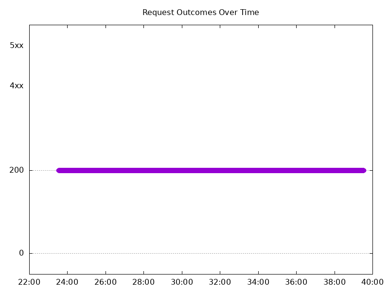

#### Test: Send http /coffee traffic

```text
Requests      [total, rate, throughput]         96000, 100.00, 100.00
Duration      [total, attack, wait]             16m0s, 16m0s, 1.113ms
Latencies     [min, mean, 50, 90, 95, 99, max]  583.608µs, 1.133ms, 1.123ms, 1.301ms, 1.368ms, 1.621ms, 206.955ms
Bytes In      [total, mean]                     15379258, 160.20
Bytes Out     [total, mean]                     0, 0.00
Success       [ratio]                           100.00%
Status Codes  [code:count]                      200:96000  
Error Set:
```


### Scale Up Abruptly

#### Test: Send http /coffee traffic

```text
Requests      [total, rate, throughput]         12000, 100.01, 74.91
Duration      [total, attack, wait]             2m0s, 2m0s, 706.902µs
Latencies     [min, mean, 50, 90, 95, 99, max]  363.273µs, 980.321µs, 1.06ms, 1.271ms, 1.338ms, 1.561ms, 12.623ms
Bytes In      [total, mean]                     1889876, 157.49
Bytes Out     [total, mean]                     0, 0.00
Success       [ratio]                           74.90%
Status Codes  [code:count]                      0:12  200:8988  502:3000  
Error Set:
Get "http://cafe.example.com/coffee": dial tcp 0.0.0.0:0->redacted:80: connect: connection refused
502 Bad Gateway
```

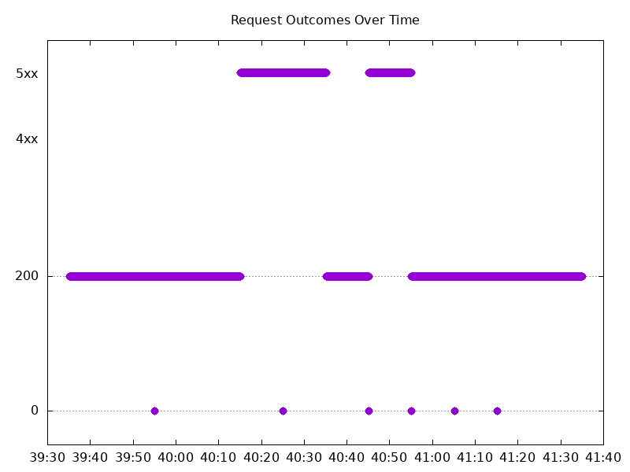

#### Test: Send https /tea traffic

```text
Requests      [total, rate, throughput]         12000, 100.01, 99.92
Duration      [total, attack, wait]             2m0s, 2m0s, 1.077ms
Latencies     [min, mean, 50, 90, 95, 99, max]  540.182µs, 1.147ms, 1.138ms, 1.32ms, 1.39ms, 1.628ms, 12.628ms
Bytes In      [total, mean]                     1847648, 153.97
Bytes Out     [total, mean]                     0, 0.00
Success       [ratio]                           99.92%
Status Codes  [code:count]                      0:10  200:11990  
Error Set:
Get "https://cafe.example.com/tea": dial tcp 0.0.0.0:0->redacted:443: connect: connection refused
```

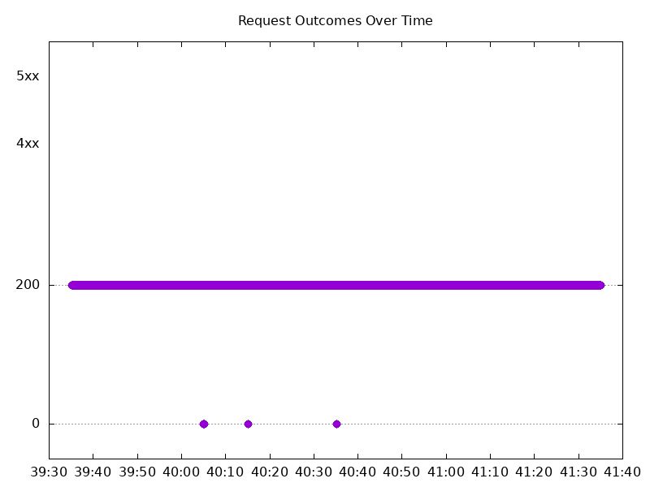

### Scale Down Abruptly

#### Test: Send http /coffee traffic

```text
Requests      [total, rate, throughput]         12000, 100.01, 91.67
Duration      [total, attack, wait]             2m0s, 2m0s, 1.117ms
Latencies     [min, mean, 50, 90, 95, 99, max]  401.425µs, 1.104ms, 1.117ms, 1.3ms, 1.364ms, 1.598ms, 217.29ms
Bytes In      [total, mean]                     1912123, 159.34
Bytes Out     [total, mean]                     0, 0.00
Success       [ratio]                           91.67%
Status Codes  [code:count]                      200:11000  502:1000  
Error Set:
502 Bad Gateway
```

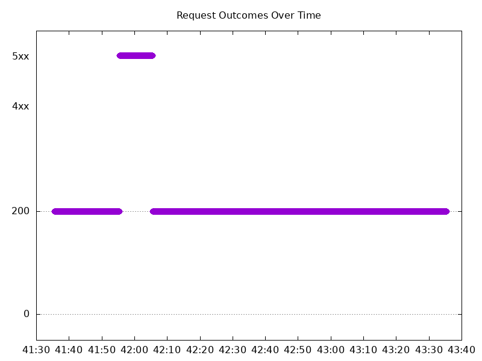

#### Test: Send https /tea traffic

```text
Requests      [total, rate, throughput]         12000, 100.01, 100.01
Duration      [total, attack, wait]             2m0s, 2m0s, 1.072ms
Latencies     [min, mean, 50, 90, 95, 99, max]  627.313µs, 1.143ms, 1.142ms, 1.308ms, 1.371ms, 1.519ms, 8.844ms
Bytes In      [total, mean]                     1849201, 154.10
Bytes Out     [total, mean]                     0, 0.00
Success       [ratio]                           100.00%
Status Codes  [code:count]                      200:12000  
Error Set:
```

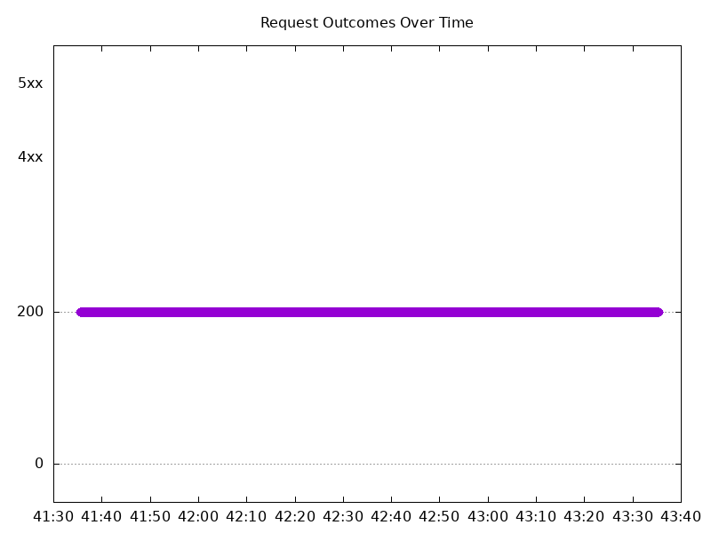
