# Results

## Test environment

NGINX Plus: false

NGINX Gateway Fabric:

- Commit: 9155a2b6a8d3179165797ef3e789e97283f7a695
- Date: 2025-03-15T07:17:11Z
- Dirty: false

GKE Cluster:

- Node count: 12
- k8s version: v1.31.6-gke.1020000
- vCPUs per node: 16
- RAM per node: 65851340Ki
- Max pods per node: 110
- Zone: us-west1-b
- Instance Type: n2d-standard-16

## One NGF Pod runs per node Test Results

### Scale Up Gradually

#### Test: Send https /tea traffic

```text
Requests      [total, rate, throughput]         30000, 100.00, 100.00
Duration      [total, attack, wait]             5m0s, 5m0s, 806.452µs
Latencies     [min, mean, 50, 90, 95, 99, max]  433.68µs, 873.614µs, 867.783µs, 993.691µs, 1.043ms, 1.351ms, 12.859ms
Bytes In      [total, mean]                     4646890, 154.90
Bytes Out     [total, mean]                     0, 0.00
Success       [ratio]                           100.00%
Status Codes  [code:count]                      200:30000  
Error Set:
```


#### Test: Send http /coffee traffic

```text
Requests      [total, rate, throughput]         30000, 100.00, 100.00
Duration      [total, attack, wait]             5m0s, 5m0s, 1.573ms
Latencies     [min, mean, 50, 90, 95, 99, max]  412.342µs, 847.173µs, 847.018µs, 972.99µs, 1.017ms, 1.314ms, 12.59ms
Bytes In      [total, mean]                     4823979, 160.80
Bytes Out     [total, mean]                     0, 0.00
Success       [ratio]                           100.00%
Status Codes  [code:count]                      200:30000  
Error Set:
```

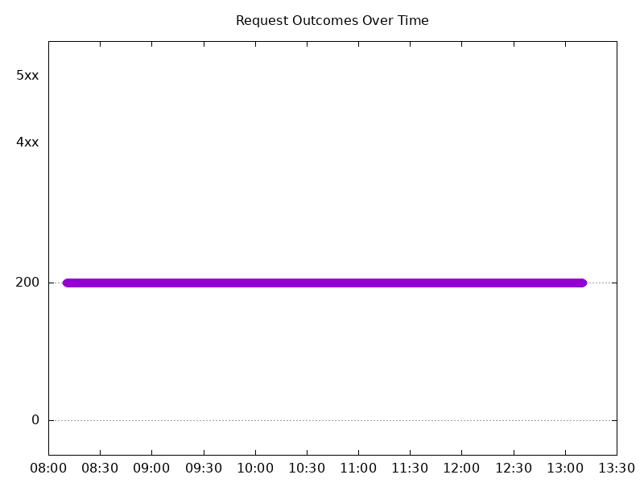

### Scale Down Gradually

#### Test: Send http /coffee traffic

```text
Requests      [total, rate, throughput]         48000, 100.00, 100.00
Duration      [total, attack, wait]             8m0s, 8m0s, 901.369µs
Latencies     [min, mean, 50, 90, 95, 99, max]  400.666µs, 872.136µs, 870.908µs, 1.012ms, 1.064ms, 1.269ms, 12.942ms
Bytes In      [total, mean]                     7718342, 160.80
Bytes Out     [total, mean]                     0, 0.00
Success       [ratio]                           100.00%
Status Codes  [code:count]                      200:48000  
Error Set:
```

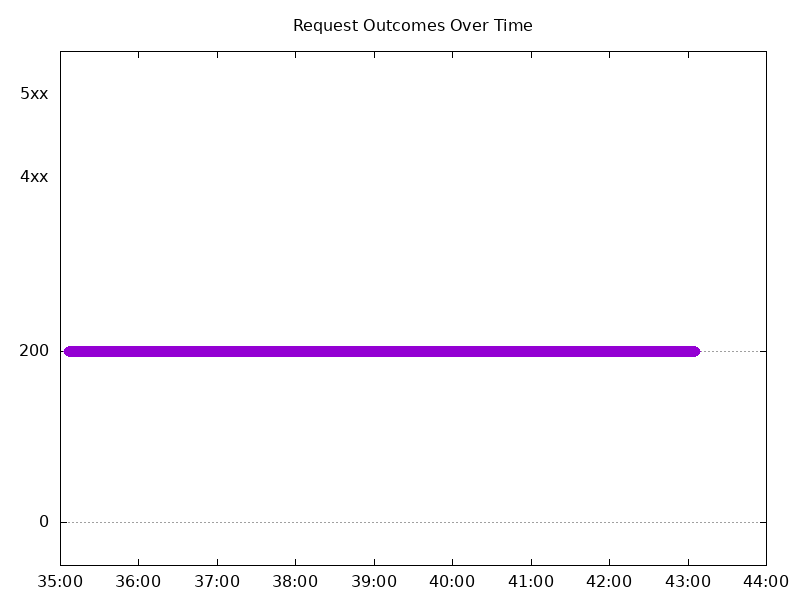

#### Test: Send https /tea traffic

```text
Requests      [total, rate, throughput]         48000, 100.00, 100.00
Duration      [total, attack, wait]             8m0s, 8m0s, 941.614µs
Latencies     [min, mean, 50, 90, 95, 99, max]  417.468µs, 901.578µs, 895.785µs, 1.037ms, 1.091ms, 1.325ms, 13.219ms
Bytes In      [total, mean]                     7435362, 154.90
Bytes Out     [total, mean]                     0, 0.00
Success       [ratio]                           100.00%
Status Codes  [code:count]                      200:48000  
Error Set:
```

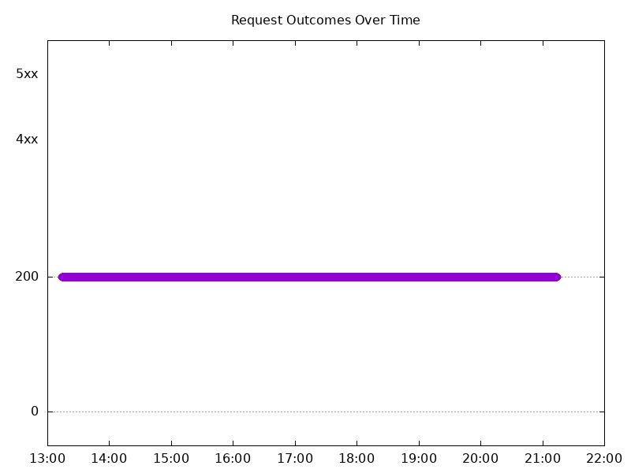

### Scale Up Abruptly

#### Test: Send https /tea traffic

```text
Requests      [total, rate, throughput]         12000, 100.01, 100.01
Duration      [total, attack, wait]             2m0s, 2m0s, 1.117ms
Latencies     [min, mean, 50, 90, 95, 99, max]  455.668µs, 904.422µs, 904.957µs, 1.033ms, 1.082ms, 1.248ms, 5.631ms
Bytes In      [total, mean]                     1858693, 154.89
Bytes Out     [total, mean]                     0, 0.00
Success       [ratio]                           100.00%
Status Codes  [code:count]                      200:12000  
Error Set:
```

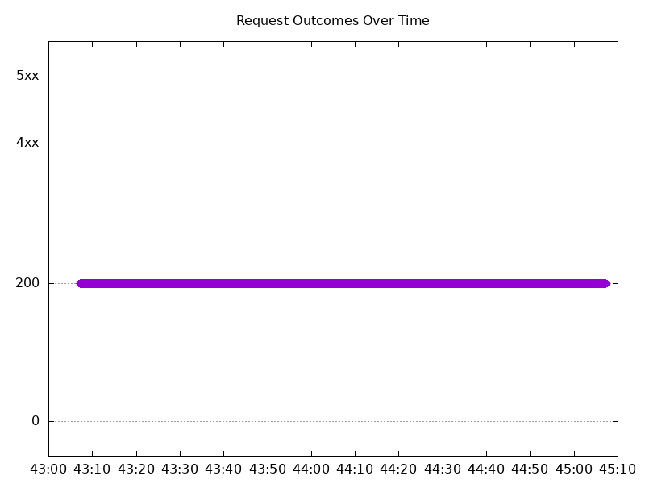

#### Test: Send http /coffee traffic

```text
Requests      [total, rate, throughput]         12000, 100.01, 100.01
Duration      [total, attack, wait]             2m0s, 2m0s, 1.119ms
Latencies     [min, mean, 50, 90, 95, 99, max]  412.944µs, 891.737µs, 891.196µs, 1.028ms, 1.081ms, 1.282ms, 9.702ms
Bytes In      [total, mean]                     1929586, 160.80
Bytes Out     [total, mean]                     0, 0.00
Success       [ratio]                           100.00%
Status Codes  [code:count]                      200:12000  
Error Set:
```

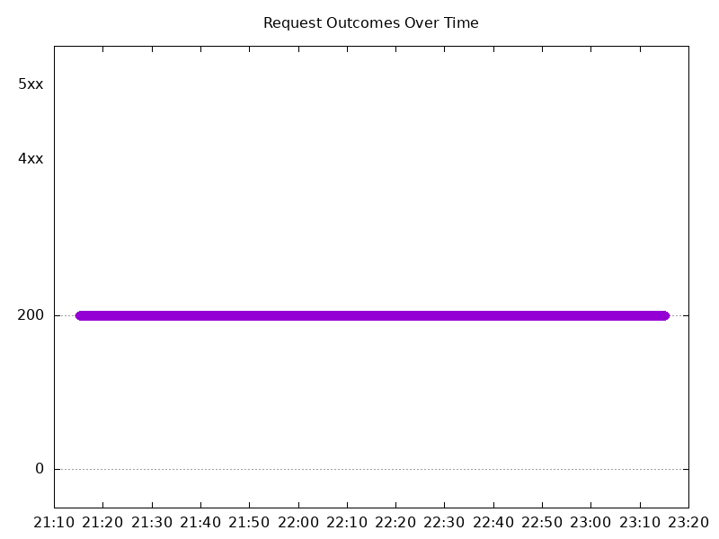

### Scale Down Abruptly

#### Test: Send https /tea traffic

```text
Requests      [total, rate, throughput]         12000, 100.01, 100.01
Duration      [total, attack, wait]             2m0s, 2m0s, 713.199µs
Latencies     [min, mean, 50, 90, 95, 99, max]  494.231µs, 953.041µs, 942.581µs, 1.108ms, 1.176ms, 1.337ms, 10.627ms
Bytes In      [total, mean]                     1858836, 154.90
Bytes Out     [total, mean]                     0, 0.00
Success       [ratio]                           100.00%
Status Codes  [code:count]                      200:12000  
Error Set:
```

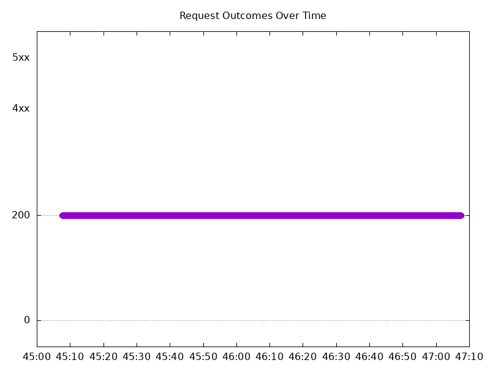

#### Test: Send http /coffee traffic

```text
Requests      [total, rate, throughput]         12000, 100.01, 100.01
Duration      [total, attack, wait]             2m0s, 2m0s, 968.062µs
Latencies     [min, mean, 50, 90, 95, 99, max]  478.648µs, 936.553µs, 928.014µs, 1.105ms, 1.171ms, 1.332ms, 10.648ms
Bytes In      [total, mean]                     1929503, 160.79
Bytes Out     [total, mean]                     0, 0.00
Success       [ratio]                           100.00%
Status Codes  [code:count]                      200:12000  
Error Set:
```

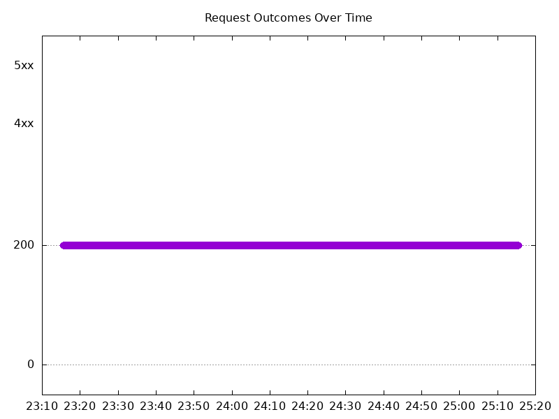

## Multiple NGF Pods run per node Test Results

### Scale Up Gradually

#### Test: Send http /coffee traffic

```text
Requests      [total, rate, throughput]         30000, 100.00, 100.00
Duration      [total, attack, wait]             5m0s, 5m0s, 873.094µs
Latencies     [min, mean, 50, 90, 95, 99, max]  443.965µs, 917.539µs, 914.468µs, 1.045ms, 1.096ms, 1.453ms, 25.238ms
Bytes In      [total, mean]                     4829927, 161.00
Bytes Out     [total, mean]                     0, 0.00
Success       [ratio]                           100.00%
Status Codes  [code:count]                      200:30000  
Error Set:
```

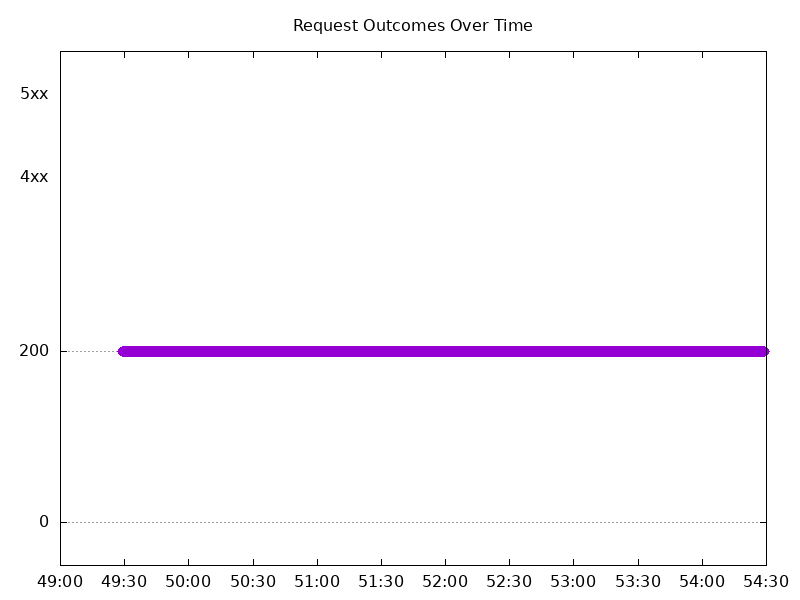

#### Test: Send https /tea traffic

```text
Requests      [total, rate, throughput]         30000, 100.00, 100.00
Duration      [total, attack, wait]             5m0s, 5m0s, 860.394µs
Latencies     [min, mean, 50, 90, 95, 99, max]  468.09µs, 940.797µs, 930.888µs, 1.071ms, 1.133ms, 1.485ms, 25.057ms
Bytes In      [total, mean]                     4652973, 155.10
Bytes Out     [total, mean]                     0, 0.00
Success       [ratio]                           100.00%
Status Codes  [code:count]                      200:30000  
Error Set:
```

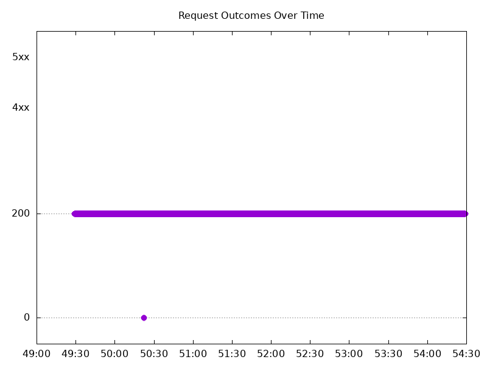

### Scale Down Gradually

#### Test: Send https /tea traffic

```text
Requests      [total, rate, throughput]         96000, 100.00, 100.00
Duration      [total, attack, wait]             16m0s, 16m0s, 1.096ms
Latencies     [min, mean, 50, 90, 95, 99, max]  470.107µs, 956.329µs, 946.839µs, 1.102ms, 1.167ms, 1.419ms, 22.663ms
Bytes In      [total, mean]                     14889791, 155.10
Bytes Out     [total, mean]                     0, 0.00
Success       [ratio]                           100.00%
Status Codes  [code:count]                      200:96000  
Error Set:
```

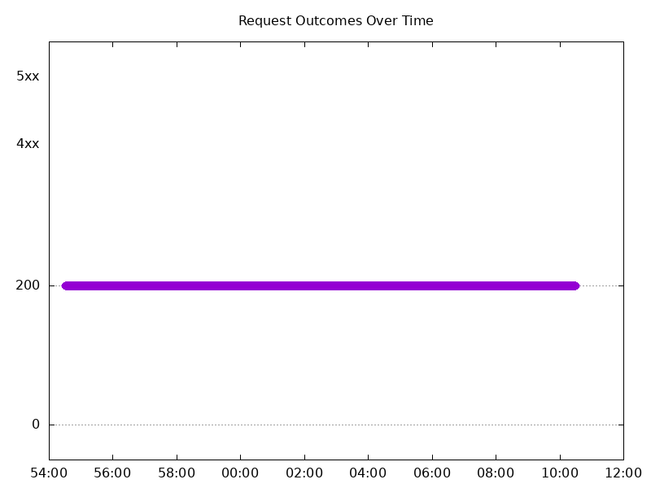

#### Test: Send http /coffee traffic

```text
Requests      [total, rate, throughput]         96000, 100.00, 100.00
Duration      [total, attack, wait]             16m0s, 16m0s, 909.045µs
Latencies     [min, mean, 50, 90, 95, 99, max]  438.459µs, 925.315µs, 923.188µs, 1.065ms, 1.12ms, 1.373ms, 21.282ms
Bytes In      [total, mean]                     15456075, 161.00
Bytes Out     [total, mean]                     0, 0.00
Success       [ratio]                           100.00%
Status Codes  [code:count]                      200:96000  
Error Set:
```

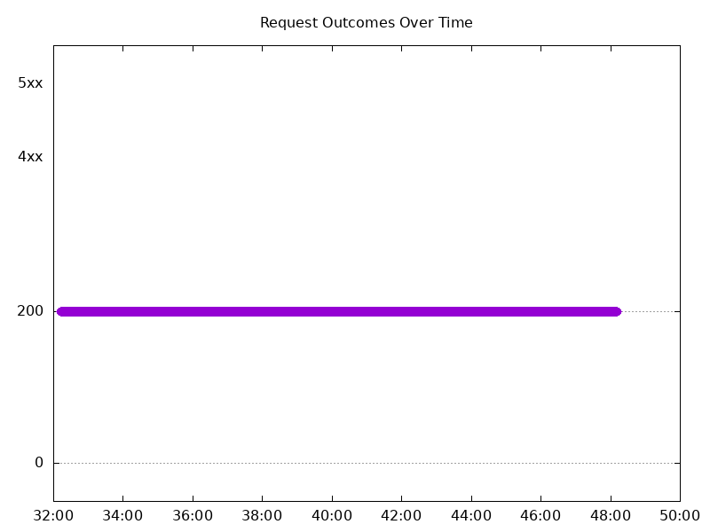

### Scale Up Abruptly

#### Test: Send https /tea traffic

```text
Requests      [total, rate, throughput]         12000, 100.01, 100.01
Duration      [total, attack, wait]             2m0s, 2m0s, 1.1ms
Latencies     [min, mean, 50, 90, 95, 99, max]  534.726µs, 973.229µs, 963.738µs, 1.127ms, 1.189ms, 1.369ms, 7.262ms
Bytes In      [total, mean]                     1861155, 155.10
Bytes Out     [total, mean]                     0, 0.00
Success       [ratio]                           100.00%
Status Codes  [code:count]                      200:12000  
Error Set:
```

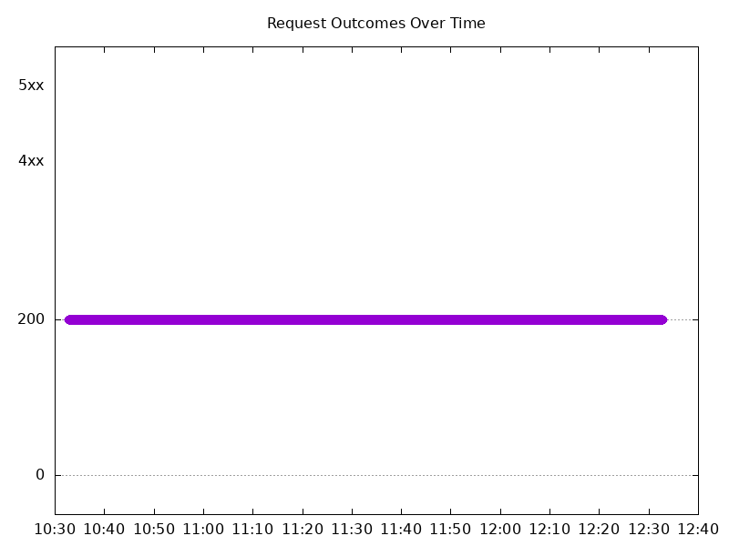

#### Test: Send http /coffee traffic

```text
Requests      [total, rate, throughput]         12000, 100.01, 100.01
Duration      [total, attack, wait]             2m0s, 2m0s, 912.394µs
Latencies     [min, mean, 50, 90, 95, 99, max]  484.225µs, 933.174µs, 935.072µs, 1.065ms, 1.109ms, 1.305ms, 11.145ms
Bytes In      [total, mean]                     1932089, 161.01
Bytes Out     [total, mean]                     0, 0.00
Success       [ratio]                           100.00%
Status Codes  [code:count]                      200:12000  
Error Set:
```


### Scale Down Abruptly

#### Test: Send http /coffee traffic

```text
Requests      [total, rate, throughput]         12000, 100.01, 100.01
Duration      [total, attack, wait]             2m0s, 2m0s, 844.643µs
Latencies     [min, mean, 50, 90, 95, 99, max]  452.528µs, 904.647µs, 912.865µs, 1.037ms, 1.076ms, 1.194ms, 6.917ms
Bytes In      [total, mean]                     1932017, 161.00
Bytes Out     [total, mean]                     0, 0.00
Success       [ratio]                           100.00%
Status Codes  [code:count]                      200:12000  
Error Set:
```

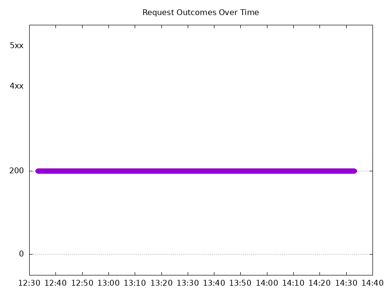

#### Test: Send https /tea traffic

```text
Requests      [total, rate, throughput]         12000, 100.01, 100.01
Duration      [total, attack, wait]             2m0s, 2m0s, 701.654µs
Latencies     [min, mean, 50, 90, 95, 99, max]  511.224µs, 936.573µs, 932.311µs, 1.074ms, 1.128ms, 1.304ms, 7.938ms
Bytes In      [total, mean]                     1861196, 155.10
Bytes Out     [total, mean]                     0, 0.00
Success       [ratio]                           100.00%
Status Codes  [code:count]                      200:12000  
Error Set:
```

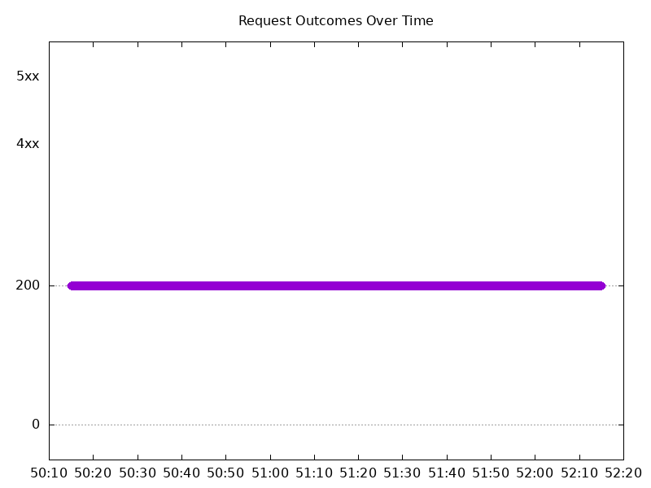
