# Results

## Test environment

NGINX Plus: true

NGINX Gateway Fabric:

- Commit: 66d6f36a8896cb0991348a7acc380ff4897a7e96
- Date: 2025-05-20T17:14:57Z
- Dirty: false

GKE Cluster:

- Node count: 12
- k8s version: v1.32.3-gke.1785003
- vCPUs per node: 16
- RAM per node: 65851340Ki
- Max pods per node: 110
- Zone: us-west1-b
- Instance Type: n2d-standard-16

## One NGINX Pod runs per node Test Results

### Scale Up Gradually

#### Test: Send http /coffee traffic

```text
Requests      [total, rate, throughput]         30000, 100.00, 100.00
Duration      [total, attack, wait]             5m0s, 5m0s, 1.281ms
Latencies     [min, mean, 50, 90, 95, 99, max]  515.409µs, 1.099ms, 1.08ms, 1.262ms, 1.33ms, 1.614ms, 218.516ms
Bytes In      [total, mean]                     4775988, 159.20
Bytes Out     [total, mean]                     0, 0.00
Success       [ratio]                           100.00%
Status Codes  [code:count]                      200:30000  
Error Set:
```


#### Test: Send https /tea traffic

```text
Requests      [total, rate, throughput]         30000, 100.00, 100.00
Duration      [total, attack, wait]             5m0s, 5m0s, 1.256ms
Latencies     [min, mean, 50, 90, 95, 99, max]  589.919µs, 1.164ms, 1.113ms, 1.323ms, 1.404ms, 1.692ms, 216.981ms
Bytes In      [total, mean]                     4596070, 153.20
Bytes Out     [total, mean]                     0, 0.00
Success       [ratio]                           100.00%
Status Codes  [code:count]                      200:30000  
Error Set:
```

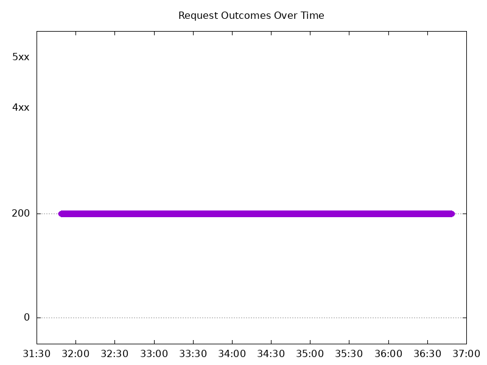

### Scale Down Gradually

#### Test: Send https /tea traffic

```text
Requests      [total, rate, throughput]         48000, 100.00, 100.00
Duration      [total, attack, wait]             8m0s, 8m0s, 1.532ms
Latencies     [min, mean, 50, 90, 95, 99, max]  637.028µs, 1.163ms, 1.157ms, 1.335ms, 1.4ms, 1.615ms, 20.507ms
Bytes In      [total, mean]                     7353627, 153.20
Bytes Out     [total, mean]                     0, 0.00
Success       [ratio]                           100.00%
Status Codes  [code:count]                      200:48000  
Error Set:
```

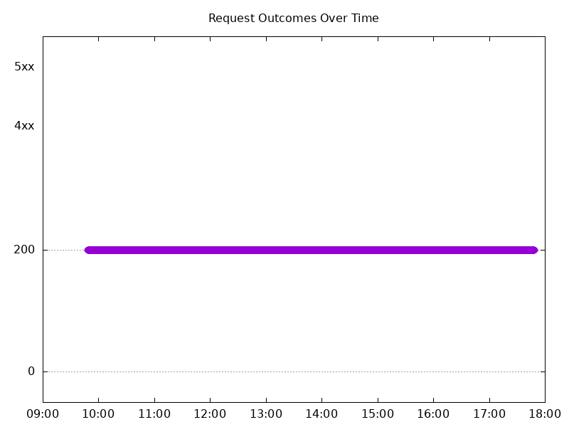

#### Test: Send http /coffee traffic

```text
Requests      [total, rate, throughput]         48000, 100.00, 100.00
Duration      [total, attack, wait]             8m0s, 8m0s, 1.558ms
Latencies     [min, mean, 50, 90, 95, 99, max]  562.998µs, 1.131ms, 1.128ms, 1.304ms, 1.361ms, 1.566ms, 40.018ms
Bytes In      [total, mean]                     7641585, 159.20
Bytes Out     [total, mean]                     0, 0.00
Success       [ratio]                           100.00%
Status Codes  [code:count]                      200:48000  
Error Set:
```

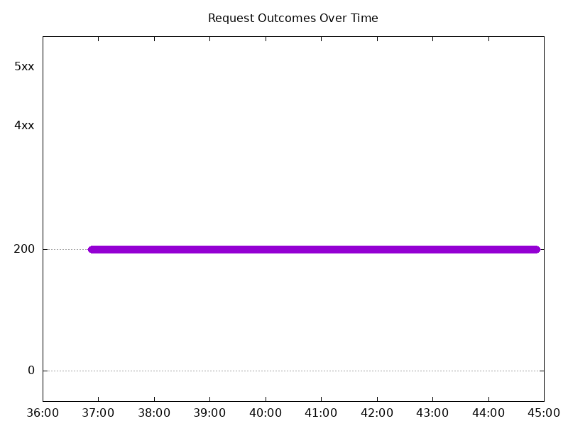

### Scale Up Abruptly

#### Test: Send https /tea traffic

```text
Requests      [total, rate, throughput]         12000, 100.01, 100.01
Duration      [total, attack, wait]             2m0s, 2m0s, 1.272ms
Latencies     [min, mean, 50, 90, 95, 99, max]  634.091µs, 1.178ms, 1.138ms, 1.301ms, 1.36ms, 1.573ms, 208.54ms
Bytes In      [total, mean]                     1838488, 153.21
Bytes Out     [total, mean]                     0, 0.00
Success       [ratio]                           100.00%
Status Codes  [code:count]                      200:12000  
Error Set:
```

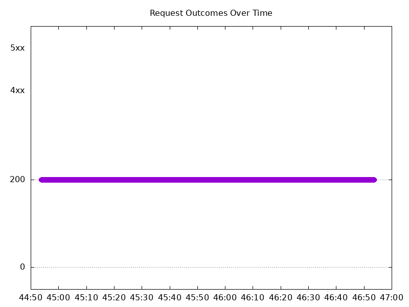

#### Test: Send http /coffee traffic

```text
Requests      [total, rate, throughput]         12000, 100.01, 83.34
Duration      [total, attack, wait]             2m0s, 2m0s, 549.786µs
Latencies     [min, mean, 50, 90, 95, 99, max]  389.965µs, 1.019ms, 1.081ms, 1.267ms, 1.325ms, 1.49ms, 5.198ms
Bytes In      [total, mean]                     1891642, 157.64
Bytes Out     [total, mean]                     0, 0.00
Success       [ratio]                           83.33%
Status Codes  [code:count]                      0:2  200:10000  502:1998  
Error Set:
Get "http://cafe.example.com/coffee": dial tcp 0.0.0.0:0->104.198.6.42:80: connect: connection refused
502 Bad Gateway
```

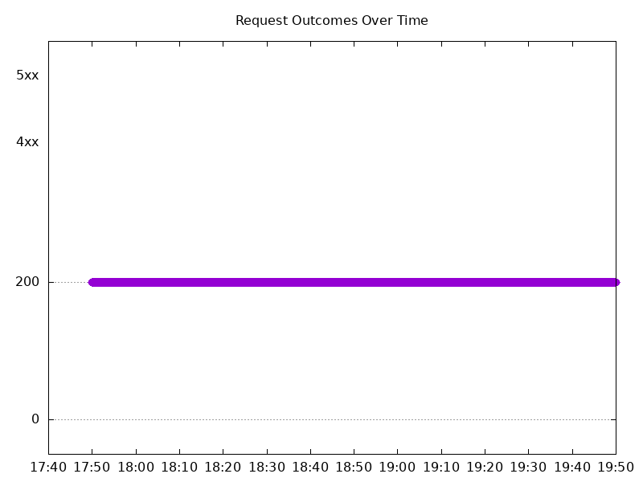

### Scale Down Abruptly

#### Test: Send https /tea traffic

```text
Requests      [total, rate, throughput]         12000, 100.01, 100.01
Duration      [total, attack, wait]             2m0s, 2m0s, 1.184ms
Latencies     [min, mean, 50, 90, 95, 99, max]  655.043µs, 1.2ms, 1.123ms, 1.298ms, 1.359ms, 1.514ms, 216.394ms
Bytes In      [total, mean]                     1838371, 153.20
Bytes Out     [total, mean]                     0, 0.00
Success       [ratio]                           100.00%
Status Codes  [code:count]                      200:12000  
Error Set:
```

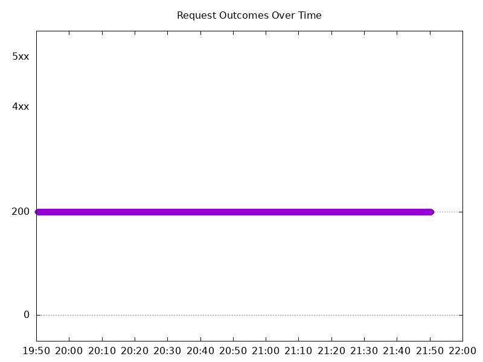

#### Test: Send http /coffee traffic

```text
Requests      [total, rate, throughput]         12000, 100.01, 83.34
Duration      [total, attack, wait]             2m0s, 2m0s, 1.092ms
Latencies     [min, mean, 50, 90, 95, 99, max]  385.661µs, 999.806µs, 1.061ms, 1.236ms, 1.291ms, 1.419ms, 28.285ms
Bytes In      [total, mean]                     1892080, 157.67
Bytes Out     [total, mean]                     0, 0.00
Success       [ratio]                           83.33%
Status Codes  [code:count]                      200:10000  502:2000  
Error Set:
502 Bad Gateway
```

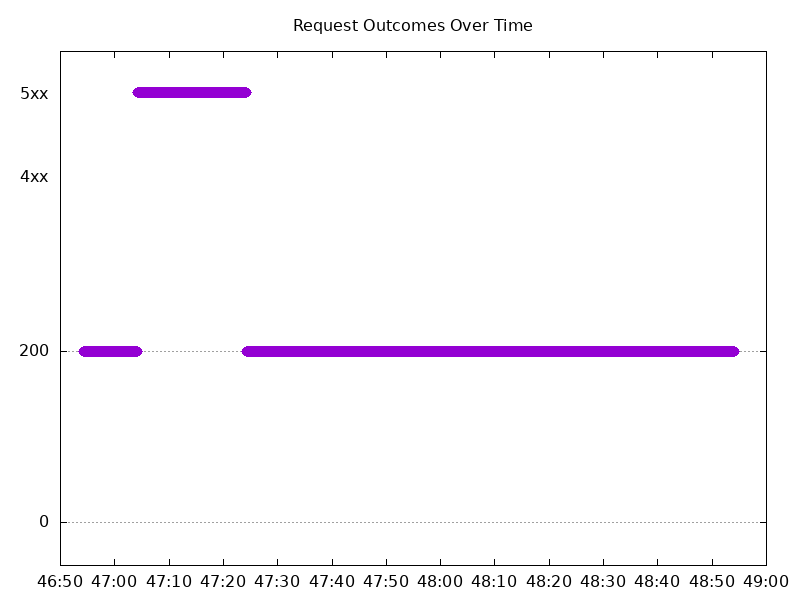

## Multiple NGINX Pods run per node Test Results

### Scale Up Gradually

#### Test: Send https /tea traffic

```text
Requests      [total, rate, throughput]         30000, 100.00, 100.00
Duration      [total, attack, wait]             5m0s, 5m0s, 1.143ms
Latencies     [min, mean, 50, 90, 95, 99, max]  637.679µs, 1.198ms, 1.173ms, 1.371ms, 1.456ms, 1.718ms, 77.974ms
Bytes In      [total, mean]                     4625810, 154.19
Bytes Out     [total, mean]                     0, 0.00
Success       [ratio]                           100.00%
Status Codes  [code:count]                      0:1  200:29999  
Error Set:
Get "https://cafe.example.com/tea": dial tcp 0.0.0.0:0->104.198.6.42:443: connect: connection refused
```

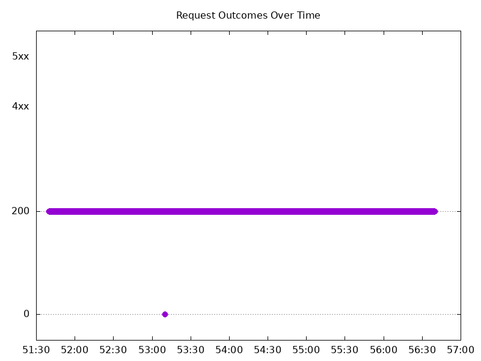

#### Test: Send http /coffee traffic

```text
Requests      [total, rate, throughput]         30000, 100.00, 100.00
Duration      [total, attack, wait]             5m0s, 5m0s, 1.107ms
Latencies     [min, mean, 50, 90, 95, 99, max]  613.967µs, 1.173ms, 1.152ms, 1.363ms, 1.451ms, 1.738ms, 206.385ms
Bytes In      [total, mean]                     4800136, 160.00
Bytes Out     [total, mean]                     0, 0.00
Success       [ratio]                           100.00%
Status Codes  [code:count]                      200:30000  
Error Set:
```

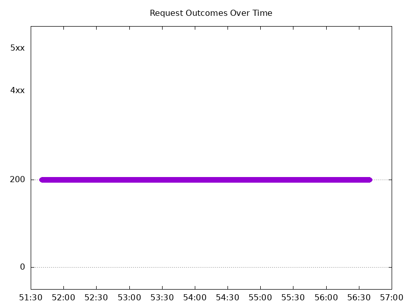

### Scale Down Gradually

#### Test: Send https /tea traffic

```text
Requests      [total, rate, throughput]         96000, 100.00, 99.99
Duration      [total, attack, wait]             16m0s, 16m0s, 1.331ms
Latencies     [min, mean, 50, 90, 95, 99, max]  103.225µs, 1.231ms, 1.207ms, 1.428ms, 1.508ms, 1.751ms, 219.8ms
Bytes In      [total, mean]                     14802221, 154.19
Bytes Out     [total, mean]                     0, 0.00
Success       [ratio]                           99.99%
Status Codes  [code:count]                      0:6  200:95994  
Error Set:
Get "https://cafe.example.com/tea": dial tcp 0.0.0.0:0->104.198.6.42:443: connect: network is unreachable
```


#### Test: Send http /coffee traffic

```text
Requests      [total, rate, throughput]         96000, 100.00, 100.00
Duration      [total, attack, wait]             16m0s, 16m0s, 1.384ms
Latencies     [min, mean, 50, 90, 95, 99, max]  53.523µs, 1.192ms, 1.165ms, 1.369ms, 1.441ms, 1.696ms, 259.683ms
Bytes In      [total, mean]                     15358929, 159.99
Bytes Out     [total, mean]                     0, 0.00
Success       [ratio]                           100.00%
Status Codes  [code:count]                      0:4  200:95996  
Error Set:
Get "http://cafe.example.com/coffee": dial tcp 0.0.0.0:0->104.198.6.42:80: connect: network is unreachable
```

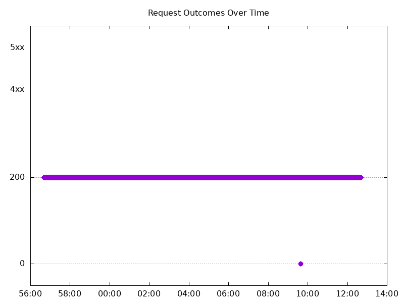

### Scale Up Abruptly

#### Test: Send http /coffee traffic

```text
Requests      [total, rate, throughput]         12000, 100.01, 90.49
Duration      [total, attack, wait]             2m0s, 2m0s, 1.187ms
Latencies     [min, mean, 50, 90, 95, 99, max]  406.379µs, 1.094ms, 1.113ms, 1.332ms, 1.412ms, 1.597ms, 5.752ms
Bytes In      [total, mean]                     1908208, 159.02
Bytes Out     [total, mean]                     0, 0.00
Success       [ratio]                           90.48%
Status Codes  [code:count]                      0:2  200:10858  502:1140  
Error Set:
Get "http://cafe.example.com/coffee": dial tcp 0.0.0.0:0->104.198.6.42:80: connect: connection refused
502 Bad Gateway
```

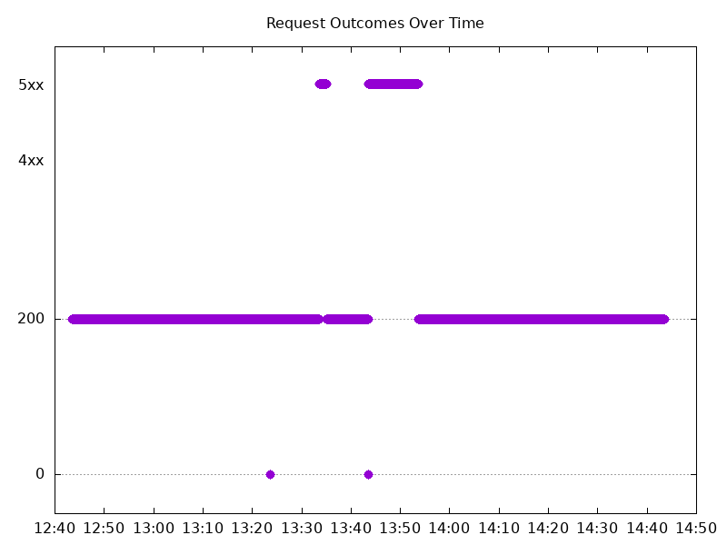

#### Test: Send https /tea traffic

```text
Requests      [total, rate, throughput]         12000, 100.01, 98.82
Duration      [total, attack, wait]             2m0s, 2m0s, 1.183ms
Latencies     [min, mean, 50, 90, 95, 99, max]  444.212µs, 1.165ms, 1.159ms, 1.365ms, 1.441ms, 1.656ms, 11.264ms
Bytes In      [total, mean]                     1848289, 154.02
Bytes Out     [total, mean]                     0, 0.00
Success       [ratio]                           98.81%
Status Codes  [code:count]                      0:10  200:11857  502:133  
Error Set:
Get "https://cafe.example.com/tea": dial tcp 0.0.0.0:0->104.198.6.42:443: connect: connection refused
502 Bad Gateway
```

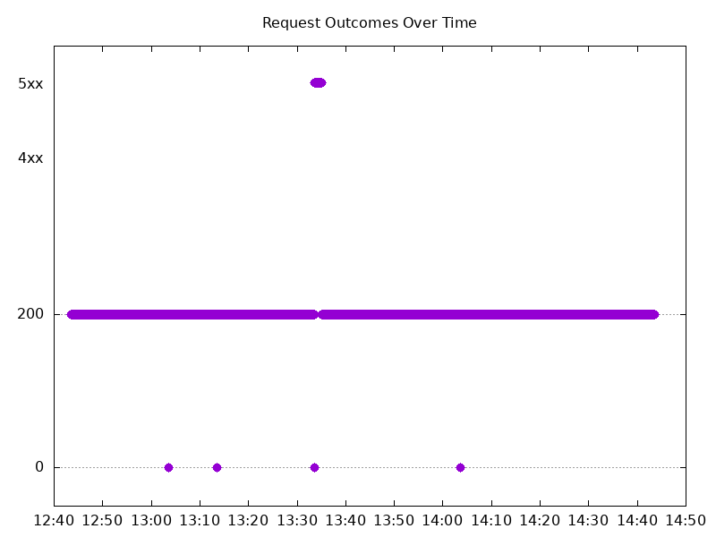

### Scale Down Abruptly

#### Test: Send https /tea traffic

```text
Requests      [total, rate, throughput]         12000, 100.01, 100.01
Duration      [total, attack, wait]             2m0s, 2m0s, 997.033µs
Latencies     [min, mean, 50, 90, 95, 99, max]  679.585µs, 1.238ms, 1.213ms, 1.418ms, 1.481ms, 1.653ms, 205.356ms
Bytes In      [total, mean]                     1850431, 154.20
Bytes Out     [total, mean]                     0, 0.00
Success       [ratio]                           100.00%
Status Codes  [code:count]                      200:12000  
Error Set:
```


#### Test: Send http /coffee traffic

```text
Requests      [total, rate, throughput]         12000, 100.01, 100.01
Duration      [total, attack, wait]             2m0s, 2m0s, 965.724µs
Latencies     [min, mean, 50, 90, 95, 99, max]  616.281µs, 1.194ms, 1.185ms, 1.385ms, 1.451ms, 1.626ms, 45.327ms
Bytes In      [total, mean]                     1920085, 160.01
Bytes Out     [total, mean]                     0, 0.00
Success       [ratio]                           100.00%
Status Codes  [code:count]                      200:12000  
Error Set:
```

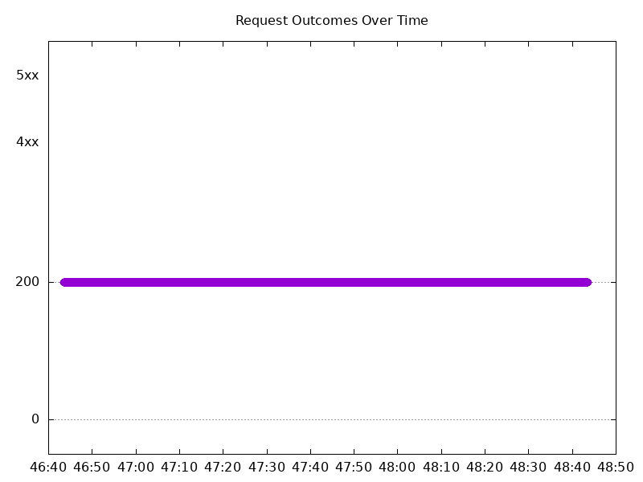
